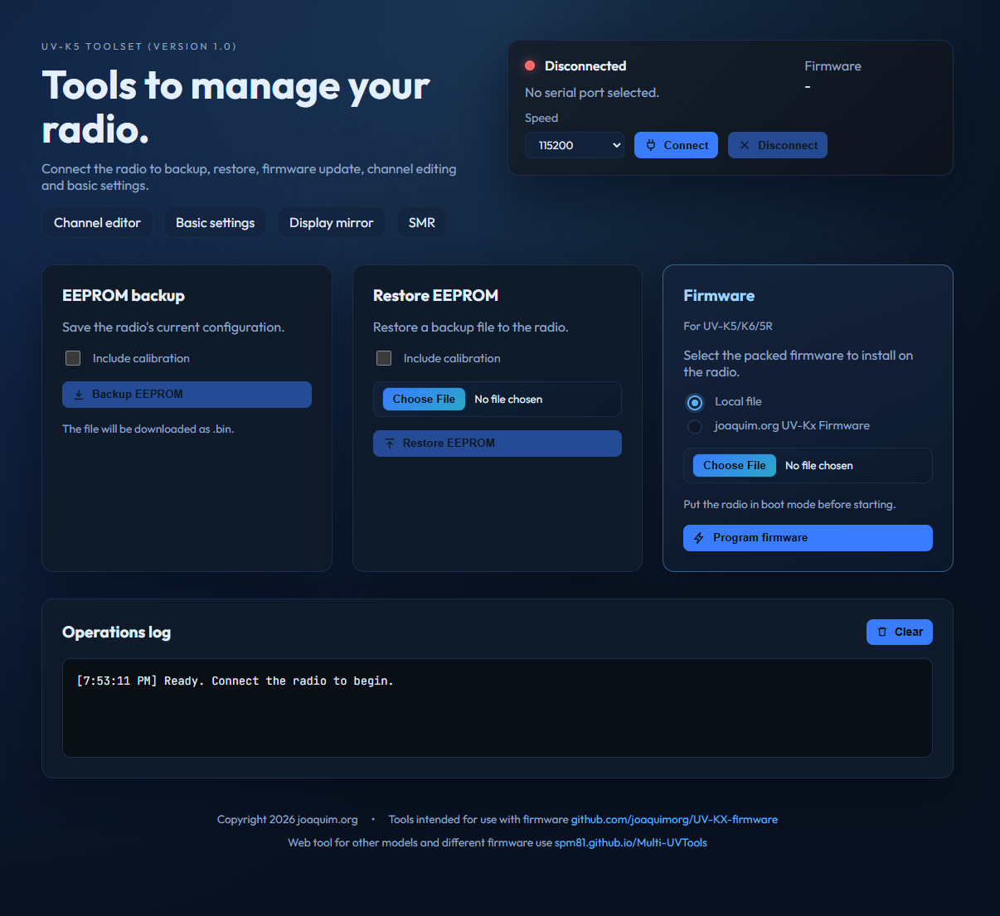

# UV-KX Tools

Web application built with Vue and Vite to connect Quansheng UV-K5/K6/5R radios via Web Serial and perform maintenance and configuration tasks. Includes EEPROM backup/restore, firmware programming, settings editing, and SMR.

This tools are intended to be used with my firmware https://github.com/joaquimorg/UV-KX-firmware for Quansheng UV-K5/K6/5R radios.

## Features

- Serial connection with baud rate selection.
- EEPROM backup (with or without calibration).
- EEPROM restore (with or without calibration).
- Firmware update from a local file or the GitHub option.
- Channel and basic settings editing.
- Display mirror.
- SMR Short Message Radio for sending and receiving SMS frames.

## Requirements

- Browser with Web Serial support (Chrome or Edge).
- USB-serial adapter driver (for example CH340/CP210x), if needed.

## Quick start

1. Open https://home.joaquim.org/k5 in a compatible browser.
2. Click Connect and select the serial port.
3. Use the tools available in the panels:
   - EEPROM Backup/Restore.
   - Firmware: select a `.bin` file or use the GitHub option.
   - Channels, basic settings, display mirror.

## Development

1. Install dependencies: `npm install`
2. Start the dev server: `npm run dev`
3. Build for production: `npm run build`

## Firmware

- Flashing uses 38400 bps and waits for the bootloader.
- Select the correct firmware file for your radio.
- Do not disconnect the device during the process.

## Notes

- Some operations require the radio to be in bootloader mode.
- If a read error occurs, check the cable, drivers, and make sure no other app is using the same port.

## License

MIT License. See `LICENSE` and `NOTICE`.
